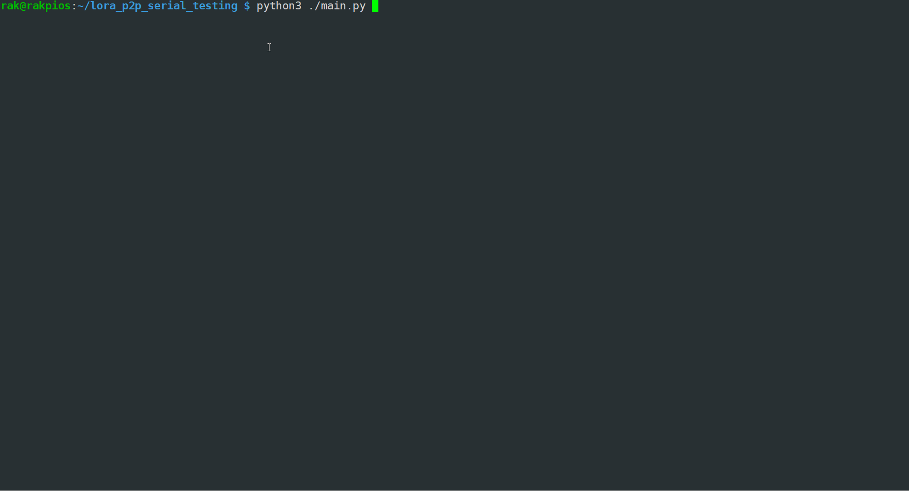

# LoRa P2P Testing with RAK4631

This guide will assist you in conducting a LoRa P2P (peer-to-peer) test using two RAK4631 devices equipped with the latest RUI3 firmware.

## Prerequisites

- Two RAK4631 devices updated with the latest RUI3 firmware.
- Python 3 installed on your machine.

## Installation

Before we begin the test, we need to install the necessary Python dependencies. You can do this by running the following command in your terminal:

```
pip install -r requirements.txt 
```

This command will install all the required Python packages listed in the `requirements.txt` file.

## Running the Test

After the installation of dependencies, you can start the test by executing the `main.py` file with Python 3. Use the following command:


```
python3 ./main.py
```

Upon execution, the script will perform a total of 10 LoRa P2P tests. The process of these tests is illustrated in the animated screen capture provided below.




